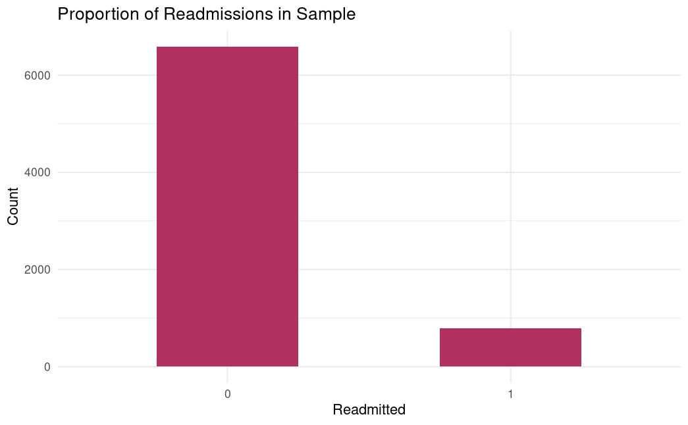
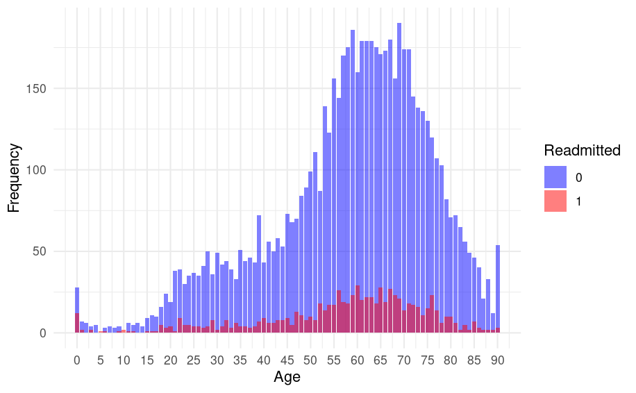
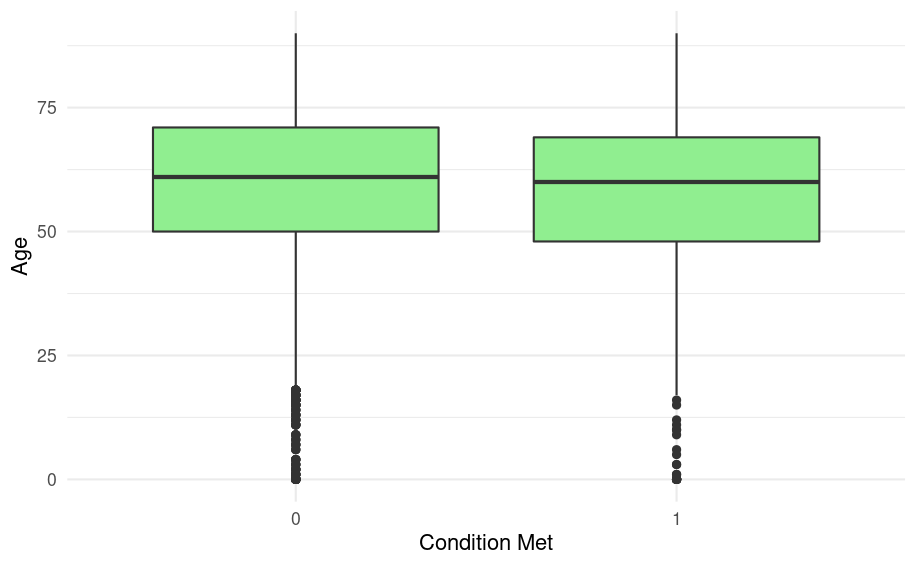
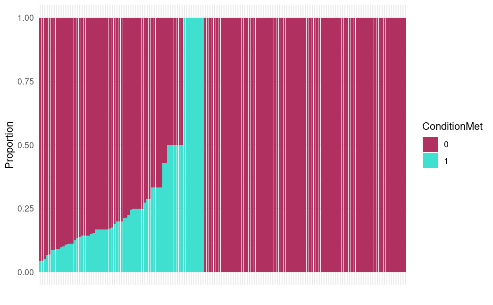
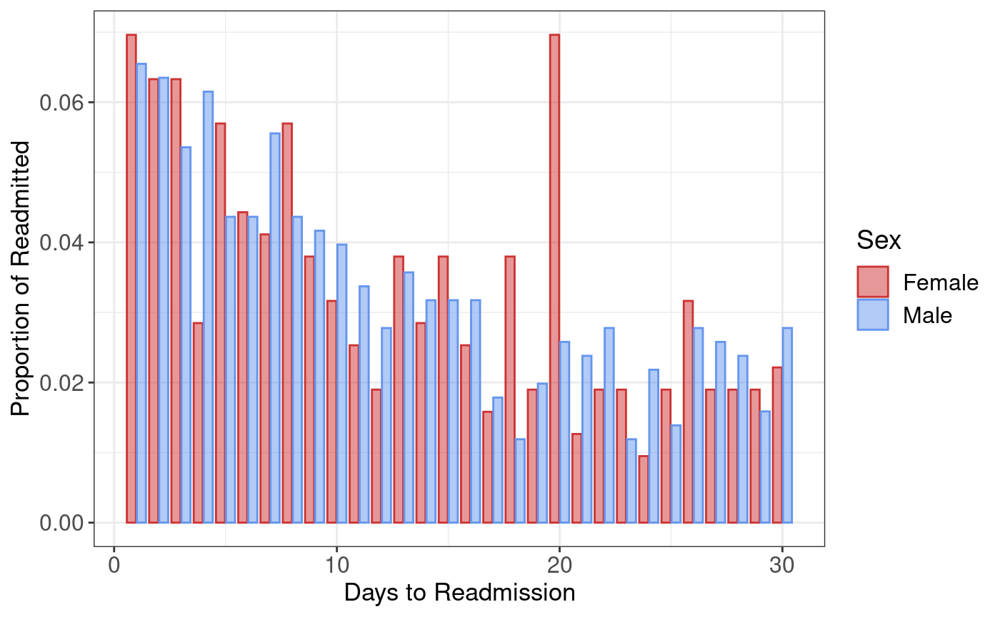
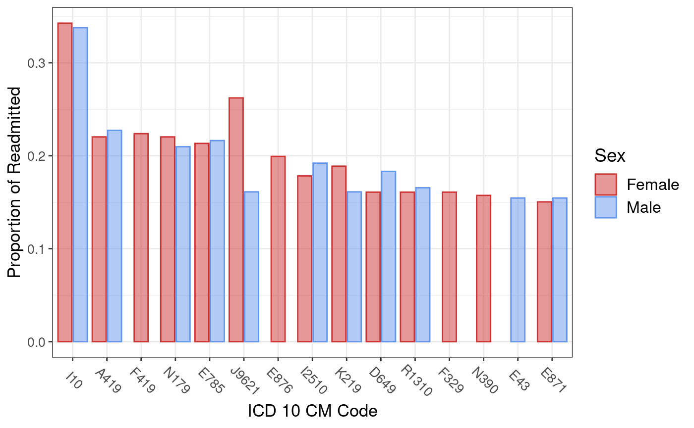

# Introduction {#sec1}

In the medical field of Otolaryngology, preventing hospital readmissions following procedures such as tracheostomies, total laryngectomies, or mastoidectomies is significant both medically for patients as well as financially for healthcare institutions. Medically, avoiding readmissions can benefit patients' well-being as it reduces the possible distress and suffering experienced from complications from new or returning medical conditions. Financially, preventing readmissions is crucial for hospitals who are paid by capitation. Capitation is a payment system that pays hospitals a fixed amount per patient for a prescribed period, therefore incentivizing hospitals to conduct less procedures and treat patients as efficiently as possible. As a result, hospitals paid by capitation incur the costs that are associated with providing care to patients who are readmitted. Knowing if a patient might be at higher risk of a readmission would allow doctors to increase the effectiveness of their initial interventions and promote a smoother recovery process while maintaining their reputation and quality of care. Therefore, developing predictive models that can predict whether a patient will be readmitted is essential for ensuring the efficiency of healthcare. \newline
\newline
This project aims to build a model that predicts if a patient who underwent a tracheostomy procedure is going to be readmitted within 30 days of being discharged from the hospital. For those patients who are readmitted within 30 days, this project also analyzes the number of days until they will be readmitted as well as the most common diagnoses that the patients will be readmitted with. The following analysis for this project was conducted on a sample of 3 million observations from the original data.

# Data Preprocessing {#sec2}

The data for this project was provided to us from the Healthcare Cost and Utilization Project (HCUP) Nationwide Readmissions Database (NRD). This database provides information on admissions and discharges for patients with and without repeat hospital visits within a given year. To address the research questions of this project, we used data from the years of 2018 and 2019, each of which had three data sets. For each year, there was a `core` data set which contained main information such as the age and sex of the patient as well as the diagnoses and procedures the patient received for this given admission. The `severity` data set provides information on the severity of the condition for a given admission and the `hospital` data set contains characteristics of the hospital the patient was admitted to such as bed size. 

## Empty Diagnoses and Procedures

The `core` data set contains 40 ICD-10-CM diagnosis code columns representing 40 possible diagnoses a patient could receive at one admission. Similarly, the data includes 25 ICD-10-PCS procedure code columns representing 25 possible procedures a patient could receive at one admission. One patient may not have 40 total diagnoses or 25 total procedures and as a result, many of the cells in these columns are empty. The first step in preparing the data for analysis was replacing these empty cells with `NA`s which will make future filtering and one-hot-encoding steps easier.

## Creating Binary Readmitted Response Column

The focus of this project is predicting readmissions for tracheostomy procedures. Therefore, our next step was to filter the `core` data set to include only those patients who received a tracheostomy during their admission. The ICD-10-PCS codes for tracheostomies all begin with "0B11" with other numbers and letters following for different tracheostomy approaches such as an open approach or percutaneous approach. We applied the filter function to the 25 procedure columns to obtain all patients who had an ICD-10-PCS code that began with "0B11" in any one of the 25 possible columns. Extracting the unique IDs or Visit Links from this filtered set and filtering `core` to get patients only with those Visit Links allowed us to create a new data frame that contained all patients who were admitted for a tracheostomy and all other admissions by that patient. A binary column was then added to this new data frame which was a 1 if the patient received a tracheostomy at the corresponding visit and 0 otherwise. For those tracheostomy admissions, we added the length of stay (LOS) variable to the days to event variable which gives us a sequence of numbers representing the "date" the patient was discharged. This data frame contains all patient admissions both before and after they received the tracheostomy. As a result, for each patient, we then filtered the data frame again to include only the tracheostomy admission and all admissions that occurred after that visit. \newline
\newline
This new data frame now allows us to create our binary response variable that is 1 if the patient was readmitted to a hospital within 30 days of being discharged from a tracheostomy procedure. If a patient had no admissions following their tracheostomy admission, the readmitted response variable was 0. If subtracting the days to event value of the next admission after the tracheostomy from the days to event value of the tracheostomy admission results in a value less than or equal to 30, the readmitted response variable was 1. If the difference of the two days to event values was greater than 30, the readmitted response variable was 0. \newline
\newline
We then removed all rows that represented hospital admissions after the tracheostomy to obtain a data frame where each row represented a unique patient's tracheostomy admission along with the binary response variable indicating if they were readmitted within 30 days of the procedure.

## Right Censoring

Right censored data is used to describe data where subjects leave the study before an event occurring or the study ends before the event has occurred. In the context of this project, right censoring can occur if a patient received a tracheostomy in December of one year and was readmitted in January of the following year. The data from the NRD is constructed in such a way that it is difficult to identify patients. The patient IDs or Visit Links change from one year to the next for the same patient. As a result, if a patient were to receive a tracheostomy in December of 2018, we would be unable to determine and therefore predict if the patient was readmitted within 30 days since it is unknown if they were readmitted in January of 2019. To solve this issue, we make our window of inclusion for patients between January and November of a given year by filtering out those patients who were admitted for a tracheostomy in December.

## One-Hot-Encoding

When creating the predictive model for readmissions, we wish to conduct comorbidity analysis which will allow us to include the presence of certain diagnoses as predictor variables. For that reason, we will need to one-hot-encode all ICD-10-CM diagnosis codes. For each unique diagnosis code in the 40 diagnosis columns, we added a column for that code which equaled 1 if the patient received the diagnosis on their tracheostomy admission and equaled 0 otherwise. 

## Joining Data Sets

The last step in preparing the data for modeling and analysis was to join the three data sets. Each data set had a NRD record identifier variable which gave a unique code to each hospital admission. Therefore, to our cleaned `core` data set, we joined the `severity` and `hospital` data sets by the record identifier. 

# Exploratory Data Analysis {#sec3}

```{r daysto, echo=FALSE, out.width = "100%", fig.align = "center", fig.cap=" Proportion of Readmissions in sample", fig.pos="H"}

```

We have a class imbalance in our dataset, where the number of instances labeled as '1s' significantly exceeds those labeled as '0s', potentially leading to model biases, poor generalization, and challenges in decision-making during training and evaluation.
In this specific situation, due to resource constraints and time limitations, we prioritized other aspects of the analysis pipeline that we deemed more critical for achieving our project objectives. However, we acknowledge the importance of addressing this imbalance in future iterations to enhance model robustness and accuracy.

```{r daysto, echo=FALSE, out.width = "100%", fig.align = "center", fig.cap=" Distribution of Patient Ages by Readmission Status after Tracheostomy", fig.pos="H"}

```

```{r daysto, echo=FALSE, out.width = "100%", fig.align = "center", fig.cap=" Median Ages of Patients by Readmission Status after Tracheostomy ", fig.pos="H"}

```

The age distributions indicate a right skew, suggesting that older patients are more inclined to undergo tracheotomies. Notably, the median age for patients with readmissions is slightly lower compared to those without readmission. While the distributions for both groups share similarities, the peak in the distribution for patients with readmissions appears sharper, indicating a more concentrated age group, whereas the distribution for patients without readmission displays a broader spread across different age groups.

```{r daysto, echo=FALSE, out.width = "100%", fig.align = "center", fig.cap="Proportion of Readmission Among APRDRG categories in the sample"", fig.pos="H"}


```

In this figure, we observe variations in readmission proportions across different APRDRG categories. AP- refined- DRGs are broader categories of diagnosis that include the severity of the diagnosis as well. Some APRDRG categories exhibit a notably higher proportion of readmissions compared to others within the sample. Consequently, we opted to incorporate APRDRG as a predictor in our analysis to account for this observed variance.

# Methods and Analysis {#sec4}

## Predictive Model

## Days to Readmission

Another objective of this project was to explore the number of days until patients were readmitted for those who were readmitted within 30 days. Figure\ \ref{fig:daysto} plots the counts of days to readmission comparing males and females. \newline

```{r daysto, echo=FALSE, out.width = "100%", fig.align = "center", fig.cap="Barplot of proportion of males and proportion of females who were readmitted to a hospital after a specific number of days following discharge.", fig.pos="H"}

```

From this figure, we can see that most readmitted patients return to the hospital within 10 days of being discharged from the tracheostomy. It is interesting to note that while the largest proportion of males are readmitted after 1 day, there is an equal proportion of females who are readmitted after 1 day as well as after 20 days of being discharged.

## Readmitted Diagnoses

We also created a similar figure looking at the most common diagnoses that patients were readmitted with. For those patients who were readmitted within 30 days of their tracheostomy discharge, we calculated the proportion of males and the proportion of females who received a particular diagnosis code at their readmitted visit. We then plotted these proportions and used the proportion cutoff of 0.15 to observe the top 15 most common readmission diagnoses.\newline
\newline
Figure\ \ref{fig:readmit_diags} shows that the most common readmitted diagnosis, with an equal proportion of males and females receiving it, is I10 which represents essential (primary) hypertension. This is followed by A419 which is sepsis, a condition in which the body responds improperly to an infection. Similar to hypertension, an equal proportion of males and females are readmitted with sepsis. \newline
\newline
The figure also shows that there are 4 common readmission diagnoses that females are diagnosed with but males are not. These codes are F419, E876, F329, and N390 which represent anxiety disorder, hypokalemia, single episode major depressive disorder, and urinary tract infection respectively. Within these top 15 most common readmission diagnoses, there is one code that males are diagnosed with and females are not: E43 representing unspecified severe protein-calorie malnutrition.

# Conclusion {#sec5}

\bmhead{Acknowledgments}

Acknowledgments are not compulsory. Where included they should be brief. Grant or contribution numbers may be acknowledged.

Please refer to Journal-level guidance for any specific requirements.

::: {.appendices latex=true}

# {#secA}

```{r readmit_diags, echo=FALSE, out.width = "100%", fig.pos="H", fig.align = "center", fig.cap = "Barplot of proportion of males and proportion of females who received specific diagnosis codes at their readmission visit."}

```

:::